# 🏗️ Arquitetura J.A.R.V.I.S. v3.0

> _Sistema modular assíncrono em produção na nuvem — projetado para escalar._

---

## 📊 Diagrama de Componentes

```mermaid
graph TD
    User((👤 Usuário))

    subgraph IL ["📥 Interface Layer"]
        Telegram[Telegram Handler v3 - aiogram]
    end

    subgraph CL ["🧩 Core Layer"]
        Orchestrator[🎯 Orchestrator]
        Config[⚙️ Config Manager]
        Container[🔧 DI Container]
        Scheduler[⏰ Scheduler v3 - APScheduler]
    end

    subgraph SL ["🔒 Security Layer"]
        Privacy[🛡️ Privacy Layer]
        Classifier[🔍 Data Classifier]
        Anonymizer[🎭 Anonymizer]
    end

    subgraph SP ["⚡ Services - Produtividade"]
        AI[🧠 AI Service - Gemini 2.5 Flash]
        Calendar[📅 Calendar Service]
        Finance[💰 Finance Service]
        Tasks[✅ Task Service]
        Reminders[🔔 Reminder Service]
        Voice[🔊 Voice Service - edge-tts]
        Drive[☁️ Drive Service]
        Classroom[🎓 Classroom Service]
        LocalAgenda[📆 Local Agenda Service]
    end

    subgraph SE ["📚 Services - Estudos"]
        StudyCoach[🧑‍🏫 Study Coach]
        SpacedRep[🔁 Spaced Repetition]
        StudyTimer[⏱️ Study Timer]
        ErrorDiary[❌ Error Diary]
        ExamService[📝 Exam Service]
        Quiz[🧩 Quiz Service]
        Notebook[📓 Notebook Service]
        Pomodoro[🍅 Pomodoro Service]
        StudyModule[📖 Study Module]
    end

    subgraph SS ["💪 Services - Saúde"]
        Trainer[🏋️ Personal Trainer]
        Running[🏃 Running Coach]
        Habits[🔥 Habit Service]
        Routine[🗓️ Routine Service]
        Dashboard[📊 Dashboard Service]
    end

    subgraph DL ["🗄️ Data Layer"]
        SQLite[(jarvis.db - SQLite)]
        MemJSON[ai_memory.json]
        GoogleAPI[☁️ Google APIs]
    end

    subgraph INF ["☁️ Infra Layer"]
        Docker[🐳 Docker - restart always]
        GCP[🌎 GCP e2-micro - Always Free]
        Backup[💾 Backup Diário - PC Local]
    end

    User --> Telegram
    Telegram --> Orchestrator
    Orchestrator --> Container
    Container --> Scheduler

    Orchestrator --> AI
    Orchestrator --> Calendar
    Orchestrator --> Finance
    Orchestrator --> Tasks
    Orchestrator --> Reminders
    Orchestrator --> Drive
    Orchestrator --> Classroom
    Orchestrator --> StudyCoach
    Orchestrator --> Trainer
    Orchestrator --> Running
    Orchestrator --> Habits
    Orchestrator --> Pomodoro
    Orchestrator --> Dashboard

    AI --> Privacy
    Privacy --> Classifier
    Privacy --> Anonymizer
    AI --> GoogleAPI

    Calendar --> GoogleAPI
    Finance --> GoogleAPI
    Tasks --> GoogleAPI
    Drive --> GoogleAPI
    Classroom --> GoogleAPI

    StudyCoach --> SQLite
    SpacedRep --> SQLite
    ErrorDiary --> SQLite
    ExamService --> SQLite
    Habits --> SQLite
    Running --> SQLite
    Finance --> SQLite

    AI --> MemJSON
    Config --> Orchestrator

    Docker --> GCP
    SQLite --> Backup
    MemJSON --> Backup
```



---

## 🧩 Camadas

### 📥 Interface Layer
- **TelegramHandler v3** (aiogram 3.x): recebe mensagens de texto, voz, foto e documento. Encapsula em contexto e delega ao Orchestrator.

### 🎯 Core Layer
- **Orchestrator**: ponto central de decisão. Roteia comandos diretos para services ou texto natural para o AIService.
- **Config**: configurações centralizadas e tipadas via dataclass.
- **DI Container**: instancia e injeta todos os services com suas dependências.
- **Scheduler v3**: gerencia tarefas agendadas assíncronas (APScheduler + AsyncIO).

### 🔒 Security Layer
- **Privacy Layer**: intercepta o contexto antes de enviar para a IA. Remove ou anonimiza dados sensíveis.
- **Data Classifier**: identifica categorias de dados (saúde, financeiro, documentos pessoais).
- **Anonymizer**: substitui valores reais por tokens anônimos reversíveis internamente.

### 🔌 Service Layer

Todos os services são registrados no Container e injetados via construtor.

| Categoria | Services |
|---|---|
| ⚡ Produtividade | AI, Calendar, Finance, Tasks, Reminders, Voice, Drive, Classroom, LocalAgenda |
| 📚 Estudos | StudyCoach, SpacedRepetition, StudyTimer, ErrorDiary, ExamService, Quiz, Notebook, Pomodoro, StudyModule |
| 💪 Saúde e Hábitos | PersonalTrainer, RunningCoach, HabitService, RoutineService, DashboardService |

### 🗄️ Data Layer
- **jarvis.db** (SQLite): banco principal — hábitos, finanças, treinos, corridas, erros, simulados, revisões
- **ai_memory.json**: memória de longo prazo da IA (fatos salvos pelo usuário)
- **Google APIs**: Calendar, Tasks, Sheets, Drive, Classroom

### ☁️ Infra Layer
- **Docker** com `restart: always` garante que o bot volta automaticamente após falhas
- **GCP e2-micro** (Always Free, us-east1): $0/mês, uptime 24/7
- **Backup diário**: script agendado no Windows copia os dados críticos da VM para o PC local

---

## 🔄 Fluxo de Mensagem

```
👤 Usuário envia mensagem (texto, voz, foto ou documento)
        |
        ▼
📥 TelegramHandler (aiogram)
   🎙️ Voz  ──► transcreve via Gemini antes de passar
   📷 Foto ──► passa como imagem para o Orchestrator
   📄 Doc  ──► salva no Drive, gera resumo
        |
        ▼
🎯 Orchestrator
   ⚡ Comando (/agenda, /habitos, /treino...) ──► 🔌 Service direto
   💬 Texto natural ─────────────────────────► 🧠 AIService
        |
        ▼
🧠 AIService
   🛡️ PrivacyLayer anonimiza dados sensíveis do contexto
   📝 Monta prompt: System Instructions + Memória + Contexto atual
   🤖 Chama Google Gemini 2.5 Flash
   🔊 Se resposta de voz: VoiceService gera áudio TTS
        |
        ▼
💬 Resposta enviada ao usuário (texto ou áudio .ogg)
```

---

## 📁 Estrutura de Diretórios

```
jarvis/
├── 🚀 run_jarvis_v3.py           # Entry point
├── ⏰ scheduler_v3.py            # Scheduler assíncrono
├── 📋 scheduler_tasks.py         # Definição das tarefas agendadas
├── core/
│   ├── 🎯 orchestrator.py        # Roteamento central
│   ├── ⚙️ config.py              # Configurações tipadas
│   ├── 📜 contracts.py           # Protocolos/interfaces
│   └── 🔧 container.py           # Injeção de dependências
├── handlers/
│   └── 📥 telegram_handler_v3.py
├── services/                     # 🔌 Todos os services (19 módulos)
├── security/
│   ├── 🛡️ privacy_layer.py
│   ├── 🔍 data_classifier.py
│   └── 🎭 anonymizer.py
├── data/
│   └── 🗄️ db.py                  # Acesso ao SQLite
├── local_data/                   # 💿 Volume Docker (dados persistentes)
│   ├── jarvis.db
│   ├── ai_memory.json
│   └── dados_dashboard.json
├── 🐳 Dockerfile
└── 🐳 docker-compose.yml
```

---

## 🚀 Deploy e Operação

### Primeiro deploy
```bash
docker compose up -d --build
```

### ⚡ Hot-deploy (sem rebuild)
```bash
# Copia o arquivo alterado
scp -i chave.key servico.py usuario@vm:/home/usuario/jarvis/services/

# Reinicia o container
ssh -i chave.key usuario@vm "cd jarvis && docker compose restart jarvis_v3"
```

### 👁️ Monitoramento
```bash
docker logs jarvis_v3 --tail=50 -f
docker ps
```

### 💾 Backup manual
```powershell
powershell -File backup_gcp.ps1
```
