# Arquitetura J.A.R.V.I.S. v3.0

## Diagrama de Componentes

```mermaid
graph TD
    User((Usuario))

    subgraph IL ["Interface Layer"]
        Telegram[Telegram Handler v3 - aiogram]
    end

    subgraph CL ["Core Layer"]
        Orchestrator[Orchestrator]
        Config[Config Manager]
        Container[DI Container]
        Scheduler[Scheduler v3 - APScheduler]
    end

    subgraph SL ["Security Layer"]
        Privacy[Privacy Layer]
        Classifier[Data Classifier]
        Anonymizer[Anonymizer]
    end

    subgraph SP ["Services - Produtividade"]
        AI[AI Service - Gemini 2.5 Flash]
        Calendar[Calendar Service]
        Finance[Finance Service]
        Tasks[Task Service]
        Reminders[Reminder Service]
        Voice[Voice Service - edge-tts]
        Drive[Drive Service]
        Classroom[Classroom Service]
        LocalAgenda[Local Agenda Service]
    end

    subgraph SE ["Services - Estudos"]
        StudyCoach[Study Coach]
        SpacedRep[Spaced Repetition]
        StudyTimer[Study Timer]
        ErrorDiary[Error Diary]
        ExamService[Exam Service]
        Quiz[Quiz Service]
        Notebook[Notebook Service]
        Pomodoro[Pomodoro Service]
        StudyModule[Study Module]
    end

    subgraph SS ["Services - Saude"]
        Trainer[Personal Trainer]
        Running[Running Coach]
        Habits[Habit Service]
        Routine[Routine Service]
        Dashboard[Dashboard Service]
    end

    subgraph DL ["Data Layer"]
        SQLite[(jarvis.db - SQLite)]
        MemJSON[ai_memory.json]
        GoogleAPI[Google APIs]
    end

    subgraph INF ["Infra Layer"]
        Docker[Docker - restart always]
        GCP[GCP e2-micro - Always Free]
        Backup[Backup Diario - PC Local]
    end

    User --> Telegram
    Telegram --> Orchestrator
    Orchestrator --> Container
    Container --> Scheduler

    Orchestrator --> AI
    Orchestrator --> Calendar
    Orchestrator --> Finance
    Orchestrator --> Tasks
    Orchestrator --> Reminders
    Orchestrator --> Drive
    Orchestrator --> Classroom
    Orchestrator --> StudyCoach
    Orchestrator --> Trainer
    Orchestrator --> Running
    Orchestrator --> Habits
    Orchestrator --> Pomodoro
    Orchestrator --> Dashboard

    AI --> Privacy
    Privacy --> Classifier
    Privacy --> Anonymizer
    AI --> GoogleAPI

    Calendar --> GoogleAPI
    Finance --> GoogleAPI
    Tasks --> GoogleAPI
    Drive --> GoogleAPI
    Classroom --> GoogleAPI

    StudyCoach --> SQLite
    SpacedRep --> SQLite
    ErrorDiary --> SQLite
    ExamService --> SQLite
    Habits --> SQLite
    Running --> SQLite
    Finance --> SQLite

    AI --> MemJSON
    Config --> Orchestrator

    Docker --> GCP
    SQLite --> Backup
    MemJSON --> Backup
```



---

## Camadas

### Interface Layer
- **TelegramHandler v3** (aiogram 3.x): recebe mensagens de texto, voz, foto e documento. Encapsula em contexto e delega ao Orchestrator.

### Core Layer
- **Orchestrator**: ponto central de decisao. Roteia comandos diretos para services ou texto natural para o AIService.
- **Config**: configuracoes centralizadas e tipadas via dataclass.
- **DI Container**: instancia e injeta todos os services com suas dependencias.
- **Scheduler v3**: gerencia tarefas agendadas assincronas (APScheduler + AsyncIO).

### Security Layer
- **Privacy Layer**: intercepta o contexto antes de enviar para a IA. Remove ou anonimiza dados sensiveis.
- **Data Classifier**: identifica categorias de dados (saude, financeiro, documentos pessoais).
- **Anonymizer**: substitui valores reais por tokens anonimos reversíveis internamente.

### Service Layer
Todos os services sao registrados no Container e injetados via construtor.

| Categoria | Services |
|---|---|
| Produtividade | AI, Calendar, Finance, Tasks, Reminders, Voice, Drive, Classroom, LocalAgenda |
| Estudos | StudyCoach, SpacedRepetition, StudyTimer, ErrorDiary, ExamService, Quiz, Notebook, Pomodoro, StudyModule |
| Saude e habitos | PersonalTrainer, RunningCoach, HabitService, RoutineService, DashboardService |

### Data Layer
- **jarvis.db** (SQLite): banco principal — habitos, financas, treinos, corridas, erros, simulados, revisoes
- **ai_memory.json**: memoria de longo prazo da IA (fatos salvos pelo usuario)
- **Google APIs**: Calendar, Tasks, Sheets, Drive, Classroom

### Infra Layer
- **Docker** com `restart: always` garante que o bot volta automaticamente apos falhas
- **GCP e2-micro** (Always Free, us-east1): $0/mes, uptime 24/7
- **Backup diario**: script agendado no Windows copia os dados criticos da VM para o PC local

---

## Fluxo de Mensagem

```
1. Usuario envia mensagem (texto, voz, foto ou documento)
        |
2. TelegramHandler (aiogram)
   - Voz  --> transcreve via Gemini antes de passar
   - Foto --> passa como imagem para o Orchestrator
   - Doc  --> salva no Drive, gera resumo
        |
3. Orchestrator
   - Comando (/agenda, /habitos, /treino...) --> Service direto
   - Texto natural                           --> AIService
        |
4. AIService
   - PrivacyLayer anonimiza dados sensiveis do contexto
   - Monta prompt: System Instructions + Memoria + Contexto atual
   - Chama Google Gemini 2.5 Flash
   - Se resposta de voz: VoiceService gera audio TTS
        |
5. Resposta enviada ao usuario (texto ou audio .ogg)
```

---

## Estrutura de Diretorios

```
jarvis/
├── run_jarvis_v3.py           # Entry point
├── scheduler_v3.py            # Scheduler assincrono
├── scheduler_tasks.py         # Definicao das tarefas agendadas
├── core/
│   ├── orchestrator.py        # Roteamento central
│   ├── config.py              # Configuracoes tipadas
│   ├── contracts.py           # Protocolos/interfaces
│   └── container.py           # Injecao de dependencias
├── handlers/
│   └── telegram_handler_v3.py
├── services/                  # Todos os services (19 modulos)
├── security/
│   ├── privacy_layer.py
│   ├── data_classifier.py
│   └── anonymizer.py
├── data/
│   └── db.py                  # Acesso ao SQLite
├── local_data/                # Volume Docker (dados persistentes)
│   ├── jarvis.db
│   ├── ai_memory.json
│   └── dados_dashboard.json
├── Dockerfile
└── docker-compose.yml
```

---

## Deploy e Operacao

### Primeiro deploy
```bash
docker compose up -d --build
```

### Hot-deploy (sem rebuild)
```bash
# Copia o arquivo alterado
scp -i chave.key servico.py usuario@vm:/home/usuario/jarvis/services/

# Reinicia o container
ssh -i chave.key usuario@vm "cd jarvis && docker compose restart jarvis_v3"
```

### Monitoramento
```bash
docker logs jarvis_v3 --tail=50 -f
docker ps
```

### Backup manual
```powershell
powershell -File backup_gcp.ps1
```
